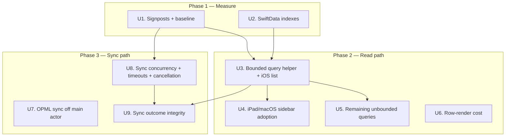

# fix: Startup speed, sync speed, and sync reliability

## Summary

Startup and sync bog down for the same underlying reason: every read path loads every article ever fetched and filters it in view code, faulting each article's `feed` relationship as it goes. This plan lands measurement first, then bounds the read path at the database level (windowed predicates, fetch limits, relationship prefetching, `fetchCount` for counts), then repairs the sync pipeline — moving the last main-actor work off it, replacing head-of-line-blocking chunked concurrency, and making sync failure honest instead of silently recording success.

---

## Problem Frame

A prior pass (`docs/plans/2026-05-31-001-fix-cold-launch-main-thread-blocking-plan.md`, completed) moved sync orchestration and article insertion off the main actor. Launch task ordering is no longer the bottleneck, but the app still bogs down — most visibly *during* sync.

The remaining cost is in the read path. Six separate `@Query` declarations fetch every `Article` in the store with no predicate and no fetch limit. `TodayView` then recomputes `filteredArticles`, `categories`, `unreadCount`, `favoritesCount`, `hasPodcastArticles`, and `hasAltArticles` on every render — each a full pass over that array, each dereferencing `article.feed?.category`, which faults the `Feed` relationship per article. Nothing in the app ever deletes an article, so this cost grows monotonically with every sync, forever.

Sync makes it worse in two ways. The insertion step commits one large `save()` at the end, which invalidates every unbounded `@Query` at once and forces a full main-thread re-fetch and re-filter. And `syncOPMLSubscriptions` still runs entirely on the `@MainActor` — network fetch, XML parse, and a per-new-feed `addFeed` that does its own network fetch and parse — directly on the main thread on every sync cycle.

Reliability is separately weak: a single slow feed stalls every subsequent feed because concurrency is implemented as sequential chunks; there are no per-request timeouts beyond `URLSession`'s 60-second default; `Task.isCancelled` is never consulted, so background-task expiry cannot stop work in flight; and the global sync timestamp is recorded even when every feed failed, so the app then skips syncing for two hours after a total failure.

---

## Requirements

- R1. Cold launch must reach an interactive article list within a measured target on a large store, and that target must hold as the store grows.
- R2. No read path may fetch the full `Article` table. Every article query must be bounded by predicate and fetch limit at the database level.
- R3. Visible article content, ordering, and filter semantics must not change. The same articles the user sees today must be the articles they see after this work.
- R4. Sync must not block or visibly jank the UI at any point, including during the OPML subscription step and during article insertion.
- R5. A single slow or hung feed must not delay the sync of unrelated feeds.
- R6. Sync must honor cancellation, so background-task expiry stops work in flight rather than running past it.
- R7. Sync must not record a successful sync when no feed succeeded.
- R8. Per-render work in the article list must not scale with total store size — derived counts and category lists must come from the database or from a cache invalidated on real change.
- R9. Every change in this plan must be verifiable against a captured baseline via Instruments, not by feel.

---

## Scope Boundaries

- No article deletion, retention window, or store-size cap. Cost is addressed by bounding queries, not by shrinking the store.
- The AI (`AIService`, `OnDeviceAIService`), text-to-speech (`ArticleAudioPlayer`), and podcast (`PodcastAudioPlayer`, `ID3ChapterService`) subsystems are not touched.
- The feed parsers (`RSSParser`, `JSONFeedParser`, `RedditJSONParser`, `OPMLParser`) are not rewritten. Parse correctness is out of scope.
- The add-feed and feed-discovery flows in `FeedManager.addFeed` are not restructured, beyond what U7 requires to call them off the main actor.
- The large view files are not decomposed. Structural refactor stops at what the read-path fixes require.
- No new sync-progress UI beyond the existing `isSyncInProgress` spinner.
- No Swift 6 strict-concurrency migration. The codebase stays in Swift 5 language mode with targeted isolation.
- `Article.guid` uniqueness is not enforced at the schema level — see Deferred.

### Deferred to Follow-Up Work

- **Article retention / pruning:** explicitly declined for this pass. Worth revisiting: bounded queries fix per-launch cost, but store size still grows without limit, which will eventually show up as disk usage, index size, and slower `fetchCount` aggregates. Separate decision, separate PR.
- **Schema-level dedup constraint on `Article.guid`:** correct uniqueness is per-feed, not global, and SwiftData's `#Unique` does not compose cleanly with a relationship key path. Dedup stays in application code (`insertArticlesInChunks`). Revisit if duplicate articles are observed in the wild.
- **Consolidating `FeedManager.syncAllFeeds()` and the `BackgroundFeedSync` path:** two sync implementations still coexist. Carried over as deferred from the prior plan; still deferred.
- **`ArticleDetailSimple` / `RedditPostView` render cost:** article *detail* rendering (notably `htmlToAttributedString`, which builds a full HTML document and parses it via `NSAttributedString`) is a real cost but is not on the startup or sync path.

---

## Context & Research

### Relevant Code and Patterns

**Read path**
- `Today/Views/TodayView.swift` — `@Query(sort: \Article.publishedDate, order: .reverse)` unbounded; `filteredArticles`, `categories`, `unreadCount`, `favoritesCount`, `hasPodcastArticles`, `hasAltArticles`, `totalUnreadCount`, `totalFavoritesCount` each full-array passes in `body`; `populatePlainTextCache()` in `.task`
- `Today/ContentView.swift` — `SidebarContentView` (iPad + macOS) has the same unbounded article query plus a manual `cachedRecentArticles` cache keyed on `allArticles.count`; `ArticleListColumn.processedArticles`; `FeedDetailView` has a feed predicate but no fetch limit
- `Today/Views/FeedListView.swift:1772`, `:2029` — two more unbounded all-article queries
- `Today/Views/AIChatView.swift:45` — unbounded all-article query, instantiated as a tab
- `ArticleRowView` in `Today/Views/TodayView.swift` — per-row `article.plainTextDescription ?? article.articleDescription?.htmlToPlainText` and `article.hasMinimalContent`
- `Today/Models/Article.swift` — `hasMinimalContent` calls `htmlToPlainText` up to three times per invocation
- `Today/Utilities/HTMLHelper.swift` — `strippingHTML` runs five regular expressions plus ~15 string replacements per call; `htmlToPlainText` is a direct alias

**Sync path**
- `Today/Services/BackgroundSyncActor.swift` — `parseAllFeedsInBackground` uses sequential `chunked(into: 5)` task groups (head-of-line blocking); `insertArticlesInChunks` does one terminal `save()` and iterates `feed.articles` twice, the second time as an O(existing × parsed) audio backfill; `UserDefaults` sync timestamp set unconditionally
- `Today/Services/BackgroundSyncManager.swift` — `syncOPMLSubscriptions` is `@MainActor` and awaits network work
- `Today/Services/OPMLSubscriptionManager.swift` — `@MainActor` class; `syncAllSubscriptions` → `syncSubscription` → `ConditionalHTTPClient.conditionalFetch` + `OPMLParser.parse` + `feedManager.addFeed` (which itself fetches and parses per new feed)
- `Today/Services/ConditionalHTTPClient.swift` — `URLSession.shared`, no explicit timeout
- `Today/Services/FeedManager.swift` — `needsSync()` reads the same `com.today.lastGlobalSyncDate` key that `BackgroundFeedSync` writes

**Existing patterns to build on**
- `nonisolated` + `await MainActor.run {}` for targeted isolation — established across `BackgroundSyncManager`
- `ModelContext(container)` for off-main work — established in `BackgroundFeedSync`, documented in `CLAUDE.md`
- `PersistentIdentifier` passing across actor boundaries — established in `ParsedFeedData` and `FeedManager.syncFeedByID()`
- `MockURLProtocol` in `TodayTests/ConditionalHTTPClientTests.swift` — the established pattern for testing network behavior deterministically
- `os.Logger` — already used in `ContentView.swift` and `OPMLSubscriptionManager.swift`
- Ad-hoc `CFAbsoluteTimeGetCurrent` timing with a >10ms log threshold in `ContentView.swift` — the instinct U1 formalizes

**Platform constraints**
- Deployment targets are iOS 18.0 / macOS 15.6, so the SwiftData `#Index` macro, `fetchCount(_:)`, and `relationshipKeyPathsForPrefetching` are all available.
- Swift 5 language mode; strict concurrency is not enabled.

### Institutional Learnings

- No `docs/solutions/` directory exists in this repo yet. The prior plan flagged SwiftData concurrency as a good candidate to document; that still hasn't happened. The bounded-query and relationship-prefetch patterns from U3 are the strongest candidate to capture once landed.
- The prior plan specified `TodayTests/BackgroundSyncTests.swift` and `TodayTests/BackgroundSyncManagerTests.swift`; neither was created. Test scenarios in this plan should be treated as part of the deliverable, not optional follow-up.

### External References

- None fetched. Local patterns plus `CLAUDE.md` cover the SwiftData and concurrency decisions here; the bottlenecks were identified by reading the code, not by needing external guidance.

---

## Key Technical Decisions

- **Bound queries at the database level, not in view code.** `filteredArticles` currently fetches everything and filters in Swift. Moving the date window, alt-category exclusion, and read/favorite filters into `#Predicate` with a `fetchLimit` means SQLite does the work against an index instead of the main thread doing it against a fully materialized array. This is the load-bearing decision — most other units depend on it.
- **Prefetch the `feed` relationship rather than denormalizing feed category onto `Article`.** Every filter touches `article.feed?.category`, faulting per article. Denormalizing would be faster still but is a schema change with a migration and a synchronization burden (feed re-categorization would need to fan out to every article). `relationshipKeyPathsForPrefetching: [\.feed]` gets most of the win with no schema change and no new invariant to maintain.
- **Derive counts with `fetchCount(_:)`, not by filtering an array.** `unreadCount` and `favoritesCount` exist only to render a number. A `fetchCount` against an indexed predicate is O(index) instead of O(store) and avoids materializing objects that are never displayed.
- **One shared query-descriptor helper, adopted by each view.** Five views need the same windowing logic with slightly different inputs. A single place that builds the `FetchDescriptor` keeps filter semantics identical across platforms (R3) and gives one place to tune limits. Views keep their own `@Query` — this is a descriptor factory, not a new data-access layer.
- **Replace the manual `cachedRecentArticles` cache in `SidebarContentView` rather than fix it.** It is keyed on `allArticles.count`, so a sync that replaces articles without changing the count silently serves stale data, and it needs a 10ms `Task.sleep` to escape the layout pass. Once the query is bounded and windowed at the database level, the cache has no reason to exist.
- **Bounded continuous concurrency instead of sequential chunks.** `chunked(into: 5)` waits for all five feeds in a chunk before starting the next, so one hung feed stalls every remaining feed. A task group that maintains five in-flight tasks and starts a new one as each completes gives the same concurrency ceiling without the barrier.
- **Per-request timeouts on a dedicated `URLSessionConfiguration`, keeping `URLSession.shared` semantics elsewhere.** The prior code comments note that ephemeral sessions with delegates caused crashes; a configured non-delegate session avoids that while bounding worst-case feed latency well below the 60-second default.
- **Record the sync timestamp only on partial success.** `needsSync()` gates on that timestamp. Writing it after a total failure means the app refuses to retry for two hours precisely when it most needs to. At least one feed must have succeeded.
- **Incremental saves per feed, not one terminal save.** One large save produces one large `@Query` invalidation and one large main-thread re-fetch — the visible mid-sync stall. Saving per feed spreads that cost, and combined with bounded queries each invalidation re-fetches a windowed slice rather than the whole table.
- **Signposts, not print statements.** `BackgroundFeedSync` currently reports via `print`, which is invisible in Instruments and costs string formatting in release. `OSSignposter` intervals are near-free when not being recorded and show up on the Instruments timeline alongside the main-thread trace.
- **Store `hasMinimalContent` as a computed-at-insert flag.** It calls `htmlToPlainText` up to three times, each running five regexes, and it is invoked per visible row. The inputs are immutable after insert, so it can be computed once during insertion and read as a stored property.

---

## Open Questions

### Resolved During Planning

- **Are `#Index`, `fetchCount(_:)`, and `relationshipKeyPathsForPrefetching` available?** Yes — deployment targets are iOS 18.0 / macOS 15.6.
- **Should retention/pruning be part of this?** No. Explicitly declined; recorded under Deferred with the tradeoff noted.
- **Should `Article.guid` get a schema-level unique constraint to speed dedup?** No. Correct uniqueness is per-feed, and SwiftData's `#Unique` does not compose cleanly with a relationship key path. Dedup stays in application code.
- **Does bounding `@Query` change what the user sees?** No, provided the predicate mirrors the existing in-view filter logic exactly and the fetch limit exceeds the largest reachable window. R3 and the U3/U4/U5 test scenarios exist to enforce this.
- **Can the OPML sync step move off the main actor?** Yes, but `OPMLSubscriptionManager` and `FeedManager` are both `@MainActor` classes holding a `mainContext`. U7 addresses this by moving the network and parse work out and keeping the model mutations on a background context, not by removing the annotations wholesale.

### Deferred to Implementation

- **Exact fetch-limit value.** Needs to be comfortably above the largest reachable day-window article count without being unbounded. Pick after the U1 baseline shows real per-day volumes.
- **Which index combinations actually get used.** SQLite's planner decides. Add the candidate indexes, then confirm against the U1 baseline and drop any that don't earn their write cost.
- **Whether per-feed incremental saves need throttling.** With many feeds this may produce enough `@Query` invalidations to be its own problem. Measure; if so, batch every N feeds instead of every feed.
- **Whether `AIChatView`'s query can be bounded or must stay broad.** It feeds trend analysis, which may legitimately want a wide window. Determine the real window from `AIService` usage during U5.
- **Concrete numeric targets for R1.** Stated as measured deltas against the U1 baseline rather than invented now.

---

## High-Level Technical Design

> *This illustrates the intended approach and is directional guidance for review, not implementation specification. The implementing agent should treat it as context, not code to reproduce.*

Current cost shape on every render and every sync save:

```
@Query (no predicate, no limit)
  └─ materializes N articles                       N = every article ever fetched
       └─ filteredArticles    → full pass, faults feed per article
       └─ categories          → full pass, faults feed per article
       └─ unreadCount         → full pass, faults feed per article
       └─ favoritesCount      → full pass, faults feed per article
       └─ hasPodcastArticles  → full pass, faults feed per article
       └─ hasAltArticles      → full pass, faults feed per article
  ... and this whole shape re-runs on each sync save, on the main thread
```

Target shape:

```
@Query (date-window predicate + fetchLimit + prefetch feed)
  └─ materializes W articles, feeds prefetched     W = current day-window slice
       └─ single derivation pass → list + category set + podcast/alt presence
  fetchCount(unread predicate)     → index-only, no materialization
  fetchCount(favorite predicate)   → index-only, no materialization
```

Sync concurrency, current vs. target:

```
now:     [f1 f2 f3 f4 f5] ──barrier──► [f6 f7 f8 f9 f10] ──barrier──► ...
         one hung feed in a chunk stalls every later chunk

target:  five slots, refilled as each completes; a hung feed occupies
         one slot until its timeout and never blocks the others
```

---

## Implementation Units



U6 and U7 have no hard dependencies and can land in parallel with the rest of their phase.

---

### U1. Signpost instrumentation and captured baseline

**Goal:** Make launch cost, sync phase cost, and article-list derivation cost visible in Instruments, and capture a baseline against a large store so every later unit has something to prove itself against. Nothing else in this plan is verifiable without this.

**Requirements:** R9

**Dependencies:** None

**Files:**
- Create: `Today/Utilities/PerformanceSignposts.swift`
- Modify: `Today/TodayApp.swift`
- Modify: `Today/Services/BackgroundSyncActor.swift`
- Modify: `Today/Services/BackgroundSyncManager.swift`
- Modify: `Today/Views/TodayView.swift`
- Modify: `Today/ContentView.swift`
- Test: `TodayTests/PerformanceSignpostsTests.swift`

**Approach:**
- Add a single shared `OSSignposter` under the existing `com.today` subsystem with a `performance` category. Expose named interval helpers for the phases that matter: app init through first frame, default-feed setup, migration, sync-total, sync-fetch-parse, sync-insert, sync-opml, and article-list derivation.
- Instrument the launch sequence in `TodayApp` and the sync phases in `BackgroundFeedSync` / `BackgroundSyncManager`. Replace the existing `print` statements in `BackgroundFeedSync` with signpost events plus `os.Logger` calls, matching the `Logger` usage already in `ContentView.swift` and `OPMLSubscriptionManager.swift`.
- Replace the ad-hoc `CFAbsoluteTimeGetCurrent` blocks in `ContentView.swift` (`computeRecentArticles`, `processedArticles`) with signposted intervals so the existing instinct becomes measurable rather than log-only.
- Add a DEBUG-only large-store seeding path alongside the existing `-ResetArticlesOnLaunch` launch argument, so a realistic store can be generated on demand rather than accumulated over weeks. Follow the same `ProcessInfo` launch-argument pattern.
- Capture the baseline and record it in the plan or an adjacent note: time to interactive list, sync wall-clock split by phase, and article-list derivation time, at several store sizes. This baseline is the deliverable, not just the instrumentation.

**Patterns to follow:**
- `os.Logger` declaration style in `Today/ContentView.swift` and `Today/Services/OPMLSubscriptionManager.swift`
- `ProcessInfo.processInfo.arguments.contains(...)` DEBUG hook in `Today/TodayApp.swift`
- The >10ms log threshold instinct in `ContentView.computeRecentArticles`

**Test scenarios:**
- Happy path: beginning and ending an interval emits a matched signpost pair; nested intervals (sync-total wrapping sync-fetch-parse) do not interleave incorrectly.
- Edge case: an interval begun but never ended — because the enclosing task was cancelled — does not leak state or crash on the next interval with the same name.
- Edge case: the DEBUG seeding path generates the requested article count across the requested feeds, with `publishedDate` values spread across the window so date-predicate work in U3 has realistic data.
- Integration: a full cold launch produces a complete, ordered signpost trace from app init to first interactive list, with no unmatched intervals.

**Verification:**
- Instruments shows the named intervals on the timeline alongside the main-thread trace, and the sync phases are visibly on non-main threads.
- Baseline numbers are recorded for at least a small and a large store, and the two differ enough to make regressions detectable.
- No `print` calls remain on the sync path.

---

### U2. Add SwiftData indexes for the predicates the read path will use

**Goal:** Give SQLite indexes to satisfy the predicates U3 introduces. Without these, moving filters into `#Predicate` trades a main-thread array scan for a full table scan.

**Requirements:** R2, R8

**Dependencies:** None (but must land before U3 for U3's measurements to mean anything)

**Files:**
- Modify: `Today/Models/Article.swift`
- Modify: `Today/Models/Feed.swift`
- Test: `TodayTests/ModelSchemaTests.swift`

**Approach:**
- Add `#Index` declarations to `Article` covering the access patterns U3 and U9 need: `publishedDate` alone (the sort and window), `guid` (dedup lookup during insertion), and the composite read/favorite plus `publishedDate` shapes that back the `fetchCount` aggregates.
- Add an `isActive` index to `Feed` — `BackgroundFeedSync.syncAllFeeds` fetches on exactly that predicate every sync.
- Verify the store opens cleanly against existing data. Adding an index is a lightweight SwiftData migration, but it is still a store change and must be confirmed against a pre-existing store, not only a fresh one.
- Treat the index set as provisional. Confirm against the U1 baseline which ones the planner actually uses and drop any that don't earn their write cost — noted as deferred.

**Patterns to follow:**
- `@Attribute(.unique)` usage in `Today/Models/OPMLSubscription.swift` — the existing precedent for schema-level attributes in this codebase
- `CLAUDE.md` guidance on schema changes and automatic migration

**Test scenarios:**
- Happy path: a store created before the index change opens without error and returns the same article and feed counts after the change.
- Happy path: a fresh store creates successfully with the new schema and round-trips an insert and fetch.
- Edge case: an existing store containing articles with duplicate `guid` values across different feeds still opens — confirms the `guid` index is not accidentally a uniqueness constraint.
- Integration: article insertion during a sync still succeeds and dedups correctly with the indexes in place.

**Verification:**
- An existing store migrates without data loss; article and feed counts match pre-change values.
- Query plans for the U3 predicates show index use rather than a full scan.
- Insertion throughput measured in U1 does not regress meaningfully from the added write cost.

---

### U3. Bounded article-query helper, adopted in the iOS list path

**Goal:** Stop fetching the whole `Article` table on the main path. Introduce one shared place that builds a windowed, limited, feed-prefetching `FetchDescriptor`, adopt it in `TodayView`, and replace the per-render full-array derivations with a single pass plus `fetchCount` aggregates. This is the core unit — most of the startup win lives here.

**Requirements:** R1, R2, R3, R8

**Dependencies:** U1 (baseline to measure against), U2 (indexes to make the predicates cheap)

**Files:**
- Create: `Today/Utilities/ArticleQuery.swift`
- Modify: `Today/Views/TodayView.swift`
- Test: `TodayTests/ArticleQueryTests.swift`
- Test: `TodayTests/TodayViewDerivationTests.swift`

**Approach:**
- Build a descriptor factory that takes the day window, alt-category visibility, category selection, and read/favorite filters and returns a `FetchDescriptor<Article>` with a matching `#Predicate`, the existing reverse `publishedDate` sort, a fetch limit, and `relationshipKeyPathsForPrefetching` covering `feed`. Also expose the count-only descriptors that back the unread and favorite aggregates.
- The predicate must mirror `TodayView.filteredArticles` semantics exactly, including the `Podcasts` pseudo-category that intentionally bypasses the date window and the alt-category include/exclude inversion. Semantic drift here is a user-visible regression (R3) — this is the highest-risk part of the unit.
- Swap `TodayView`'s unbounded `@Query` for the bounded descriptor, driving it from `daysToLoad` so `loadMoreDays()` widens the window at the database level rather than re-filtering a larger array.
- Collapse `categories`, `hasPodcastArticles`, and `hasAltArticles` into a single derivation over the already-fetched windowed slice, computed once per data change rather than per render.
- Replace `unreadCount`, `favoritesCount`, `totalUnreadCount`, and `totalFavoritesCount` with `fetchCount(_:)` calls against indexed predicates. These render a number; they should never materialize objects.
- Leave search filtering in Swift over the windowed slice. Pushing `localizedCaseInsensitiveContains` into a predicate changes matching semantics, and the input is already bounded once the window is.

**Execution note:** Write the semantic-equivalence tests first. The predicate must produce the same article set as today's in-view filter chain across the full matrix of window, category, alt, read, and favorite combinations; a test-first approach is what makes R3 checkable rather than hoped-for.

**Technical design:** *(directional — communicates the split, not the implementation)*

```
ArticleQuery
  .windowed(days:, altVisible:, category:, hideRead:, favoritesOnly:)
      → FetchDescriptor<Article>   predicate + sort + fetchLimit + prefetch(feed)
  .countDescriptor(.unread, days:, altVisible:, category:)
      → FetchDescriptor<Article>   predicate only, consumed by fetchCount

TodayView
  @Query(descriptor from daysToLoad + filters)  →  windowedArticles
  derive once per change  →  categories, hasPodcast, hasAlt
  fetchCount              →  unreadCount, favoritesCount
  filter in Swift         →  searchText only
```

**Patterns to follow:**
- The `#Predicate`-in-`init` `@Query` construction in `FeedDetailView` (`Today/ContentView.swift:929`) — the existing precedent for a predicated query in this codebase
- Existing `FetchDescriptor` + `#Predicate` usage in `Today/Services/BackgroundSyncActor.swift` and `Today/Services/OPMLSubscriptionManager.swift`

**Test scenarios:**
- Happy path: for a seeded store, the bounded descriptor returns exactly the articles today's `filteredArticles` returns, in the same order, for the default window and no filters.
- Happy path: sweeping the filter matrix — window of 1 / 2 / 7 days × alt visible / hidden × All / a specific category / `Podcasts` × hide-read on / off × favorites-only on / off — the bounded result set matches the in-view filter chain for every combination.
- Happy path: `Podcasts` selection returns podcast articles outside the date window, matching today's deliberate date-filter bypass.
- Happy path: `unreadCount` and `favoritesCount` from `fetchCount` equal the values today's array filters produce, for both the windowed and total variants.
- Edge case: empty store — descriptor returns no articles, counts are zero, no crash, and the correct `ContentUnavailableView` branch is selected.
- Edge case: store larger than the fetch limit — the limit is respected and returns the newest articles, not an arbitrary slice.
- Edge case: articles whose `feed` is nil — included or excluded consistently with today's `article.feed?.category` optional-chaining behavior, which excludes them from category matches but not from `All`.
- Edge case: `daysToLoad` widening past the available data — returns everything available without error.
- Edge case: an article whose `publishedDate` is in the future — sorts and windows the same way it does today.
- Error path: a malformed or unsatisfiable descriptor surfaces as a caught error and an empty list, not a crash.
- Integration: after a sync inserts new articles, the bounded query refreshes and the derived counts update — confirms `@Query` invalidation still reaches a predicated query.
- Integration: derivation time measured via the U1 signpost does not grow with total store size, only with window size.

**Verification:**
- Instruments shows article-list derivation time flat as store size grows, against the U1 baseline.
- No `@Query` in `TodayView` fetches without a predicate and limit.
- Feed relationship faulting no longer appears per article in the trace.
- Manual pass: the article list, category chips, counts, and every filter behave identically to before.

---

### U4. Adopt bounded queries in the iPad and macOS sidebar path

**Goal:** `SidebarContentView` has its own unbounded query plus a manual cache keyed on `allArticles.count` that serves stale data when a sync replaces articles without changing the count, and needs a 10ms sleep to escape the layout pass. Adopt the U3 helper and delete the cache.

**Requirements:** R1, R2, R3, R8

**Dependencies:** U3

**Files:**
- Modify: `Today/ContentView.swift`
- Test: `TodayTests/SidebarContentDerivationTests.swift`

**Approach:**
- Replace `SidebarContentView`'s unbounded article query with the U3 bounded descriptor using the seven-day window `computeRecentArticles` currently applies.
- Remove `cachedRecentArticles`, `lastArticleCount`, `lastShowAltFeeds`, `updateCachedArticlesIfNeeded()`, and the `Task.sleep(for: .milliseconds(10))` layout-escape hack. A bounded query updates reactively; the cache exists only because the unbounded one could not.
- Keep the auto-select-first-article behavior on launch, but drive it from the bounded result rather than the cache. Preserve the `oldCount == 0 && newCount > 0` first-load trigger semantics.
- Bound `ArticleListColumn.processedArticles` — its filter and sort run over whatever array it is handed. Once the window is bounded, its sort is bounded too; keep search in Swift as in U3.
- Add a fetch limit to `FeedDetailView`'s query. It already has a feed predicate but no limit, so a feed with a long history still materializes everything.

**Patterns to follow:**
- U3's `ArticleQuery` descriptor factory
- The existing `#Predicate`-in-`init` `@Query` construction already in `FeedDetailView`

**Test scenarios:**
- Happy path: the sidebar's article list matches what `computeRecentArticles` returns today for the same seven-day window, with alt visible and hidden.
- Happy path: auto-select-first-article still fires on launch when articles are present, and still fires on the zero-to-nonzero transition.
- Edge case: a sync that replaces articles without changing the total count updates the visible list — the specific staleness bug the count-keyed cache had.
- Edge case: toggling alt visibility updates the list immediately, with no 10ms delay and no stale frame.
- Edge case: a feed with more articles than the fetch limit shows the newest ones in `FeedDetailView` without materializing the rest.
- Integration: on macOS, sidebar selection, article selection, and keyboard next/previous navigation all still operate over the bounded list.

**Verification:**
- `cachedRecentArticles` and its supporting state are gone; no `Task.sleep` remains in the sidebar update path.
- Instruments shows sidebar derivation flat as store size grows.
- Manual pass on both iPad and macOS: three-column layout, selection, and keyboard navigation unchanged.

---

### U5. Bound the remaining unbounded article queries

**Goal:** Three unbounded all-article queries remain — two in `FeedListView` and one in `AIChatView`, the latter instantiated as a tab and therefore paid at launch on iPhone. Bound them so no read path in the app fetches the whole table.

**Requirements:** R2, R3

**Dependencies:** U3

**Files:**
- Modify: `Today/Views/FeedListView.swift`
- Modify: `Today/Views/AIChatView.swift`
- Test: `TodayTests/FeedListQueryTests.swift`

**Approach:**
- Audit each of the three queries for what it actually consumes, then apply the narrowest correct bound: a feed predicate, a date window, a fetch limit, or a combination. Reuse the U3 helper where the shape matches; add a descriptor variant where it doesn't.
- `AIChatView` feeds trend analysis, which may legitimately want a wider window than the list views. Determine the real window from how `AIService` consumes the array rather than assuming the list window applies — an over-tight bound here silently degrades AI output, which is a correctness regression, not a perf win.
- Confirm whether the tab-hosted `AIChatView` query is actually evaluated at launch or only on first tab selection. If it is evaluated eagerly, that is a launch cost worth reporting in the U1 trace regardless of the bound applied.

**Patterns to follow:**
- U3's `ArticleQuery` descriptor factory
- The `#Predicate`-in-`init` `@Query` pattern in `FeedDetailView`

**Test scenarios:**
- Happy path: each bounded query returns the same articles its consumer previously received, for a store smaller than the bound.
- Happy path: `AIService` trend analysis over the bounded set produces the same categories and keywords it produces over the full set, for a representative store.
- Edge case: a store larger than each bound returns the newest articles and does not error.
- Edge case: empty store — each consuming view renders its empty state correctly.
- Integration: on iPhone, launching straight into the AI tab still populates, and the U1 launch trace shows no full-table fetch.

**Verification:**
- No `@Query` over `Article` anywhere in the app lacks both a predicate and a fetch limit.
- The U1 launch trace shows no full-table article fetch during launch.
- AI chat and feed list behavior is unchanged by manual inspection.

---

### U6. Remove HTML stripping from the row render path

**Goal:** `ArticleRowView` calls `htmlToPlainText` when `plainTextDescription` is nil, and `hasMinimalContent` calls it up to three more times — each running five regexes plus roughly fifteen string replacements, per visible row, during scrolling. Compute both at insert time and replace the launch-time backfill with a bounded off-main one.

**Requirements:** R1, R8

**Dependencies:** None

**Files:**
- Modify: `Today/Models/Article.swift`
- Modify: `Today/Services/BackgroundSyncActor.swift`
- Modify: `Today/Views/TodayView.swift`
- Modify: `Today/Services/DatabaseMigration.swift`
- Test: `TodayTests/ArticleDerivedFieldsTests.swift`

**Approach:**
- Add a stored flag on `Article` carrying the `hasMinimalContent` result, computed in the initializer where `plainTextDescription` is already computed. The inputs (`content`, `contentEncoded`, `articleDescription`) do not change after insert, so the value is stable. Keep the existing computed property as the fallback for articles predating the change so behavior degrades rather than breaks.
- Update `ArticleRowView` to read the stored flag and the stored plain text, with the computed path as fallback only.
- Replace `TodayView.populatePlainTextCache()` — currently a `.task` that filters every article on the main actor and saves on every appearance — with a bounded, resumable backfill on a background `ModelContext`, following the U1-established off-main pattern. Move it out of the view's `.task` entirely; a view is the wrong owner for a data migration.
- Extend the backfill to populate the new stored flag for pre-existing articles, guarded by `UserDefaults` the way `DatabaseMigration` already guards its migrations.
- Do not touch `htmlToAttributedString` or the detail-view render path. That cost is real but off the startup and sync path — recorded under Deferred.

**Execution note:** Add characterization tests pinning current `strippingHTML` and `hasMinimalContent` output before changing where they are called. These paths have subtle entity-decoding and 300-character-threshold behavior that is easy to alter accidentally, and `TodayTests/HTMLHelperTests.swift` already exists as the place to extend.

**Patterns to follow:**
- Existing `plainTextDescription` precomputation in `Article.init` — the same instinct, applied to one more field
- `UserDefaults`-guarded migration structure in `Today/Services/DatabaseMigration.swift`
- Background `ModelContext(container)` write pattern in `BackgroundFeedSync.insertArticlesInChunks`

**Test scenarios:**
- Happy path: a newly inserted article has both `plainTextDescription` and the minimal-content flag populated, and the flag equals what the computed property returns for the same inputs.
- Happy path: the backfill populates both fields for pre-existing articles and marks itself complete so it does not run again.
- Edge case: content exactly at the 300-character threshold classifies identically before and after — the boundary the computed property tests.
- Edge case: an article with no content, no `contentEncoded`, and no description is classified minimal, as today.
- Edge case: an article with HTML entities, CDATA, and numeric or hex character references produces byte-identical plain text to the current implementation.
- Edge case: the backfill is cancelled partway — completed articles keep their values, the guard is not set, and the next launch resumes without duplicating work.
- Error path: the backfill's save throws — the error is logged, the guard is not set, and the app continues.
- Integration: scrolling a long list performs no HTML stripping — verified via the U1 signpost or an Instruments trace showing no `strippingHTML` frames during scroll.

**Verification:**
- Instruments shows no regex or HTML-stripping work on the main thread during list scrolling.
- Row content renders identically to before across Reddit, podcast, minimal, and full-content articles.
- The backfill runs off the main actor and does not run from a view's `.task`.

---

### U7. Move the OPML subscription sync off the main actor

**Goal:** `syncOPMLSubscriptions` runs on the `@MainActor` and awaits `OPMLSubscriptionManager.syncAllSubscriptions()`, which fetches over the network, parses XML, and calls `FeedManager.addFeed` — itself a network fetch plus parse — per new feed. All of it on the main thread, on every sync cycle. This is the largest remaining main-thread block during sync.

**Requirements:** R4

**Dependencies:** None

**Files:**
- Modify: `Today/Services/BackgroundSyncManager.swift`
- Modify: `Today/Services/OPMLSubscriptionManager.swift`
- Test: `TodayTests/OPMLSyncConcurrencyTests.swift`

**Approach:**
- Split `syncSubscription` into a nonisolated fetch-and-parse stage returning a `Sendable` diff result, and a model-mutation stage that applies it. Extract only `Sendable` values before crossing the boundary, following the `ParsedFeedData` precedent in `BackgroundSyncActor`.
- Apply the diff on a background `ModelContext(container)` rather than `mainContext`, matching the established off-main write pattern. Pass `PersistentIdentifier` values across the boundary, never model objects.
- Keep `@Published isSyncing` and `syncError` main-actor-isolated, updated via `await MainActor.run {}` — the same granular pattern `BackgroundSyncManager` already uses for `isSyncInProgress`.
- Adding a new feed currently routes through `FeedManager.addFeed`, which is `@MainActor` and does its own network fetch and initial sync. Route the network and parse portion off-main and keep only the model mutation on the background context. Do not restructure `addFeed`'s discovery logic beyond what this requires — that is out of scope.
- Preserve the existing duplicate-guard semantics exactly. The `deduplicateFeeds` migration in `DatabaseMigration` exists because an earlier OPML sync bug created duplicate feeds; this refactor must not reintroduce that class of bug. Note that the same duplicate check now runs against a background context, so the checks and the insert must be ordered so a concurrent sync cannot interleave between them.

**Execution note:** Characterize the current add / skip / deactivate diff behavior with tests before restructuring. This code has a history of duplicate-creation bugs, and the existing dedup migration is the evidence.

**Patterns to follow:**
- `ParsedFeedData` Sendable-boundary struct in `Today/Services/BackgroundSyncActor.swift`
- `nonisolated` + `await MainActor.run {}` granular isolation in `Today/Services/BackgroundSyncManager.swift`
- Background `ModelContext(container)` writes in `BackgroundFeedSync.insertArticlesInChunks`
- `MockURLProtocol` in `TodayTests/ConditionalHTTPClientTests.swift` for deterministic OPML fetch tests

**Test scenarios:**
- Happy path: a subscription whose OPML gained a feed adds exactly that feed, with the correct category and subscription linkage.
- Happy path: a subscription whose OPML dropped a feed deactivates exactly that feed and does not delete it.
- Happy path: a 304 response updates `lastFetched` and cache headers and makes no feed changes.
- Happy path: the fetch and parse stage runs off the main thread — asserted via `Thread.isMainThread == false` inside the stage.
- Edge case: an OPML entry matching an existing user-added feed is skipped and not claimed by the subscription, as today.
- Edge case: an OPML entry matching a feed by `sourceURL` rather than `url` is recognized as existing and not duplicated.
- Edge case: two sync cycles overlapping on the same subscription produce no duplicate feeds — the specific failure the existing dedup migration was written to clean up.
- Edge case: malformed OPML XML is caught per subscription and the remaining subscriptions still sync.
- Error path: a network failure on one subscription is logged and does not abort the others.
- Error path: the background context save throws — the error is surfaced through `syncError` on the main actor and sync continues.
- Integration: a full sync cycle with an OPML subscription configured shows no main-thread network or parse work in the trace.

**Verification:**
- Instruments shows no OPML network or XML parse work on the main thread during a sync.
- Feed add, skip, and deactivate outcomes are identical to before across the scenarios above.
- No duplicate feeds after repeated and overlapping sync cycles.

---

### U8. Bounded continuous concurrency, request timeouts, and cancellation

**Goal:** `parseAllFeedsInBackground` processes feeds in sequential chunks of five, so one hung feed stalls every later chunk. There are no explicit request timeouts, and `Task.isCancelled` is never consulted, so background-task expiry cannot stop work in flight. Fix all three.

**Requirements:** R5, R6, R4

**Dependencies:** U1 (to measure the wall-clock improvement)

**Files:**
- Modify: `Today/Services/BackgroundSyncActor.swift`
- Modify: `Today/Services/ConditionalHTTPClient.swift`
- Test: `TodayTests/SyncConcurrencyTests.swift`
- Test: `TodayTests/ConditionalHTTPClientTests.swift`

**Approach:**
- Replace the `chunked(into: 5)` loop with a single task group that keeps a fixed number of tasks in flight and starts a new one as each completes. Same concurrency ceiling, no barrier between groups. Remove the now-unused `Array.chunked` extension if nothing else uses it.
- Add explicit request and resource timeouts. Use a dedicated `URLSessionConfiguration` rather than `URLSession.shared` so the timeout applies without a delegate — the file's existing comment warns that ephemeral sessions with delegates caused crashes, so a configured non-delegate session is the constrained option. Alternatively set the timeout per `URLRequest`; decide during implementation based on which composes better with the existing call sites.
- Check `Task.isCancelled` at the top of each feed's fetch, between fetch and parse, and between feeds in the insertion loop. Return partial results on cancellation rather than discarding completed work — `handleBackgroundSync` already cancels on expiry, and today that cancellation does nothing useful.
- Ensure a timeout or cancellation for one feed yields a per-feed failure, not an aborted sync. The existing per-feed `do/catch` returning `nil` is the right boundary; confirm timeouts land inside it.

**Execution note:** Extend `TodayTests/ConditionalHTTPClientTests.swift` — its `MockURLProtocol` harness is what makes a hung-feed scenario testable deterministically rather than with real network timing.

**Technical design:** *(directional)*

```
now:      chunk(5) → await all → chunk(5) → await all → ...
                     ↑ one hung feed holds this barrier

target:   task group, ≤5 in flight
          on each completion → start next feed
          per feed: isCancelled? → fetch(timeout) → isCancelled? → parse
          any failure or timeout → nil for that feed, group continues
```

**Test scenarios:**
- Happy path: N feeds with mixed latencies all complete, and total wall-clock is bounded by the slowest single feed plus queueing, not by the sum of per-chunk maxima.
- Happy path: at most the configured number of requests are in flight at once — asserted via mock-protocol instrumentation.
- Edge case: one feed hangs past its timeout; every other feed still completes, and the hung feed yields a single failure.
- Edge case: cancellation mid-sync stops further fetches promptly and returns results for feeds already parsed.
- Edge case: all feeds fail — the function returns an empty result set without crashing, and U9's outcome handling takes over.
- Edge case: a single feed, and zero feeds — no barrier or group-sizing edge case.
- Error path: a timeout surfaces as a per-feed failure inside the existing `do/catch`, not as a thrown error escaping the group.
- Integration: a `BGAppRefreshTask` expiration triggers cancellation and the sync stops in flight rather than continuing past expiry.

**Verification:**
- Sync wall-clock with a deliberately slow feed present improves measurably against the U1 baseline.
- No sync request outlives the configured timeout.
- Cancellation demonstrably halts in-flight work, verified via the U1 signpost trace.

---

### U9. Make sync outcome honest and spread the save cost

**Goal:** Sync records `com.today.lastGlobalSyncDate` even when every feed failed, so `needsSync()` then refuses to retry for two hours precisely when it most needs to. Insertion also commits one terminal `save()`, producing one large `@Query` invalidation and the visible mid-sync stall. Fix both, and fix the O(existing × parsed) audio backfill while in the same function.

**Requirements:** R7, R4, R2

**Dependencies:** U3 (so each invalidation re-fetches a bounded window rather than the whole table), U8 (per-feed outcomes are what success is computed from)

**Files:**
- Modify: `Today/Services/BackgroundSyncActor.swift`
- Modify: `Today/Models/Feed.swift`
- Test: `TodayTests/SyncOutcomeTests.swift`

**Approach:**
- Compute a sync outcome from per-feed results and write the global timestamp only when at least one feed succeeded — where a 304 counts as success, since the server confirmed nothing changed. On total failure, leave the timestamp alone so `needsSync()` retries.
- Record per-feed failure state on `Feed` — a last-error string and a consecutive-failure count — so a persistently broken feed is diagnosable instead of silently absent from results. Do not add UI for it; that is out of scope, but the data should exist.
- Replace the single terminal `save()` with a save per feed (or per small batch, if measurement shows per-feed invalidation is itself too chatty — flagged as deferred). Each save then invalidates a bounded query rather than a full-table one.
- Fix the audio backfill loop: it iterates every existing article for the feed and calls `feedData.articles.first(where:)` inside that loop, which is O(existing × parsed) and grows with store size. Build a GUID-keyed lookup from the parsed articles once, then do a single pass. This is in the same function and the same hot path, so it belongs here rather than in its own unit.
- Avoid faulting the full `feed.articles` relationship twice per feed. Dedup and the audio backfill both need existing GUIDs; fetch what is needed once, ideally as a targeted GUID query rather than a full relationship fault, so insertion cost stops scaling with a feed's total history.
- Consider whether `context.model(for:)` is the right lookup — it can return an unrealized stub for an identifier no longer in the store, and the current `as? Feed` cast would silently skip such a feed. A fetch by identifier surfaces a deleted feed explicitly instead.

**Patterns to follow:**
- Existing per-feed `do/catch` boundary in `BackgroundFeedSync`
- `FetchDescriptor` + `#Predicate` usage already in the same file
- U2's `guid` index, which is what makes a targeted GUID lookup cheap

**Test scenarios:**
- Happy path: at least one feed succeeds — the global timestamp advances and `needsSync()` returns false immediately afterward.
- Happy path: every feed returns 304 — the timestamp advances, since the server confirmed freshness.
- Happy path: a mixed sync — successes are inserted, failures recorded on their feeds, and the timestamp advances.
- Edge case: every feed fails — the timestamp does not advance and `needsSync()` still returns true, so the next launch retries.
- Edge case: zero active feeds — the timestamp is not advanced on the basis of nothing having been attempted.
- Edge case: a feed whose `PersistentIdentifier` no longer resolves because it was deleted mid-sync — handled explicitly, with no crash and no silent skip.
- Edge case: a feed with a large existing article history — insertion time does not scale with that history, confirming the GUID lookup replaced the full relationship fault.
- Edge case: an existing article gaining an audio enclosure on a later sync is updated exactly once, with the same result the current O(n×m) loop produces.
- Edge case: all parsed articles are duplicates — no inserts occur, and the dedup set is genuinely populated rather than empty from a failed relationship fault.
- Error path: a per-feed save throws — the error is recorded on that feed, and the remaining feeds still sync and save.
- Integration: a sync inserting many articles across many feeds produces no single visible UI stall — confirmed by the U1 signpost trace showing spread saves instead of one spike.
- Integration: consecutive failure counts increment across repeated syncs of a permanently broken feed and reset on its first success.

**Verification:**
- After a total-failure sync, a relaunch attempts sync again rather than waiting two hours.
- Instruments shows insertion cost flat as a feed's article history grows.
- No single main-thread spike during insertion; the U1 trace shows distributed saves.
- Per-feed error state is populated for feeds that fail and cleared for feeds that recover.

---

## System-Wide Impact

- **Interaction graph:** `ArticleQuery` (U3) becomes a shared dependency of `TodayView`, `SidebarContentView`, `ArticleListColumn`, `FeedDetailView`, `FeedListView`, and possibly `AIChatView`. A semantic error in its predicate propagates to every article surface in the app simultaneously — which is why U3's test matrix is the widest in this plan. `BackgroundSyncManager.performBackgroundSync()` remains the single sync entry point; `FeedManager.syncAllFeeds()` (manual sync from `FeedListView`) stays on its own path, unchanged.
- **Error propagation:** Per-feed failures stay contained in the existing `do/catch` boundary and now also persist onto `Feed` (U9). OPML failures stay per-subscription (U7). Neither aborts a sync. The one intentional escalation is the global timestamp, which now depends on aggregate outcome rather than merely reaching the end of the function.
- **State lifecycle risks:** U9's per-feed saves mean a cancelled sync leaves a partially-updated store — correct, since each feed's save is individually consistent, but it means `lastFetched` will be advanced for some feeds and not others after a cancellation. U6's backfill must be resumable for the same reason. U7 moves OPML mutations to a background context, so the ordering of duplicate-check and insert must be tight enough that a concurrent sync cannot interleave between them.
- **API surface parity:** No public API. Internal signature changes are `ArticleQuery` (new), `OPMLSubscriptionManager.syncSubscription` (split into stages), and `Feed` gaining failure-state properties. `Article` gains one stored property. Both model changes are lightweight SwiftData migrations and must be verified against a pre-existing store (U2, U6).
- **Integration coverage:** The scenarios unit tests will not prove are: cold launch through first interactive list on a large store; a sync running while the user scrolls; a `BGAppRefreshTask` expiring mid-sync; and behavior across all three layouts (iPhone tabs, iPad sidebar, macOS sidebar). Each needs a manual pass with Instruments attached.
- **Unchanged invariants:** Visible article content, ordering, and filter semantics (R3). The `FeedManager.syncAllFeeds()` manual path. The `BGAppRefreshTask` registration and scheduling. Duplicate detection by GUID. `@Query` reactivity — views continue to update automatically on background save. The two-hour `needsSync()` threshold. The `Podcasts` pseudo-category's deliberate date-window bypass.

---

## Risks & Dependencies

| Risk | Likelihood | Impact | Mitigation |
|---|---|---|---|
| U3's predicate drifts from current filter semantics, changing which articles users see | Med | High | Test-first semantic-equivalence matrix across every filter combination (U3 execution note); R3 is an explicit requirement, not an assumption |
| Fetch limit set too low silently hides articles at the window edge | Med | High | Limit chosen from U1 baseline day-volumes with headroom; explicit edge-case test that the limit returns newest articles; deferred as a tunable |
| Indexes don't get used by the query planner, so predicates become full table scans | Med | Med | U2 lands before U3 and query plans are confirmed against the U1 baseline; provisional index set, pruned after measurement |
| U7 reintroduces duplicate feeds — the exact bug `deduplicateFeeds` migration exists to clean up | Med | High | Characterization tests before restructuring; explicit overlapping-sync test; duplicate-check and insert ordering called out in the approach |
| Per-feed saves (U9) produce enough `@Query` invalidations to become their own stall | Med | Med | Measure against U1; fall back to batching every N feeds — recorded as a deferred implementation decision |
| `Article` / `Feed` schema additions fail to migrate an existing store | Low | High | Explicit pre-existing-store migration tests in U2 and U6; additions are optional properties and indexes only |
| Bounding `AIChatView`'s query too tightly silently degrades AI trend output | Med | Med | U5 determines the window from actual `AIService` consumption; equivalence test on trend output over bounded vs. full set |
| U6's stored minimal-content flag diverges from the computed property for edge-case content | Low | Med | Characterization tests pinning current output, including the 300-character boundary; computed property retained as fallback |
| Cancellation checks (U8) leave the store in a partially-synced state | Med | Low | Per-feed saves are individually consistent; partial sync is already the semantics on failure, and the next cycle reconciles |
| Store grows without bound, eroding these gains over time | High | Med | Accepted — retention explicitly declined. Recorded under Deferred with the tradeoff stated so the decision is revisitable |
| Signpost instrumentation itself adds measurable overhead | Low | Low | `OSSignposter` intervals are near-free when not recording; U1 verification includes confirming insertion throughput does not regress |

---

## Success Metrics

All measured against the U1 baseline, on the same device and the same seeded store size. Absolute numbers are deliberately left to U1 — the point is the shape of the curve, not a number invented at plan time.

- **Time to interactive article list** on a large store improves substantially, and — more importantly — stays roughly flat as store size grows. A launch time that scales with total articles is the actual defect; a faster-but-still-scaling launch has not fixed it.
- **Article-list derivation time** scales with window size only, not with total store size. This is the single clearest signal that U3 and U4 worked.
- **Sync wall-clock with a deliberately slow feed present** approaches the slowest single feed rather than the sum of per-chunk maxima (U8).
- **No main-thread network or parse work during sync**, verified in the Instruments trace (U7).
- **No single main-thread spike during article insertion** — saves visible as distributed rather than one spike (U9).
- **No HTML-stripping frames on the main thread during list scrolling** (U6).
- **Zero unbounded `Article` queries** remain in the app (U3, U4, U5) — a static property, checkable by inspection.
- **After a total-failure sync, the next launch retries** rather than waiting out the two-hour window (U9).

---

## Alternative Approaches Considered

- **Article retention / pruning instead of bounded queries.** The most consequential fork. Deleting read, non-favorite articles past a retention window would shrink the store itself, addressing launch cost, insertion cost, index size, and disk usage in one move — a strictly larger win than bounding queries. Not chosen: it trades user-visible history for performance, and that is the user's call, not the plan's. The consequence is accepted and recorded — bounded queries fix per-launch cost while the store keeps growing, so disk usage and aggregate-count cost will drift upward over time. Revisitable as a separate decision.
- **Denormalizing feed category onto `Article` instead of prefetching the relationship.** Would eliminate relationship faulting entirely rather than merely batching it, and would let category filtering happen in a single-table predicate. Not chosen: it introduces a synchronization invariant — re-categorizing a feed would have to fan out to every one of its articles — plus a migration and backfill. Relationship prefetching captures most of the win at a fraction of the ongoing cost. Worth reconsidering if U3's measurements show faulting still dominant.
- **A dedicated data-access layer between views and SwiftData.** Would give one place to enforce bounds and one place to test them, rather than five views each holding a `@Query`. Not chosen: it is a large structural refactor across every article surface, and the plan already declares view decomposition out of scope. The `ArticleQuery` descriptor factory is the minimum shared surface that keeps filter semantics consistent (R3) without restructuring how views consume data.
- **Rewriting sync as a single actor owning all feed state.** Would resolve the concurrency questions in U7, U8, and U9 structurally rather than one at a time, and would make the two coexisting sync implementations one. Not chosen: it is a rewrite of the sync path, not a performance pass, and it would make every change in Phase 3 unverifiable against the U1 baseline. The two-implementation cleanup stays deferred.
- **Enabling Swift 6 strict concurrency to surface isolation bugs mechanically.** Tempting given how much of this plan is actor-isolation work. Not chosen: it would convert a bounded performance pass into a codebase-wide migration, and the isolation problems that matter here are already identified by reading the code.

---

## Documentation / Operational Notes

- `CLAUDE.md` should gain the bounded-query and relationship-prefetch guidance from U3 alongside its existing "create a separate ModelContext for background work" note — the two together are the SwiftData rules that matter in this codebase.
- The U1 baseline numbers should be recorded somewhere durable, not left in a terminal. They are the reference for every later performance claim and for detecting regression.
- This is a strong candidate for the repo's first `docs/solutions/` entry — SwiftData query bounding, relationship faulting, and off-main-actor sync patterns. The prior plan flagged the same opportunity and it was not taken.
- The DEBUG large-store seeding path from U1 is worth documenting alongside the existing `-ResetArticlesOnLaunch` argument in `BACKGROUND_SETUP.md` or `TROUBLESHOOTING.md`.
- No user-facing behavior change ships here, so no release-note content beyond a performance note. If retention is taken up later, that one does need user communication.

---

## Sources & References

- Prior completed plan: `docs/plans/2026-05-31-001-fix-cold-launch-main-thread-blocking-plan.md` — moved sync orchestration and insertion off the main actor; this plan builds on that rather than revisiting it
- Read path: `Today/Views/TodayView.swift`, `Today/ContentView.swift`, `Today/Views/FeedListView.swift`, `Today/Views/AIChatView.swift`
- Sync path: `Today/Services/BackgroundSyncActor.swift`, `Today/Services/BackgroundSyncManager.swift`, `Today/Services/OPMLSubscriptionManager.swift`, `Today/Services/ConditionalHTTPClient.swift`, `Today/Services/FeedManager.swift`
- Models: `Today/Models/Article.swift`, `Today/Models/Feed.swift`
- Cost sources: `Today/Utilities/HTMLHelper.swift`, `Today/Services/DatabaseMigration.swift`
- Test patterns: `TodayTests/ConditionalHTTPClientTests.swift` (`MockURLProtocol`), `TodayTests/HTMLHelperTests.swift`
- `CLAUDE.md` — SwiftData background-context guidance
